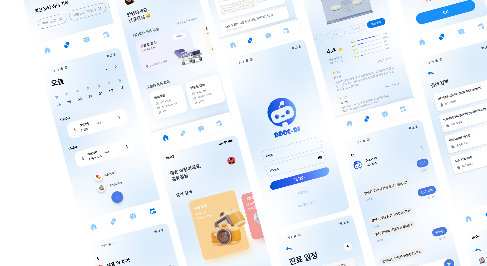

### 💊 **DDocDi (똑디) - 모바일 약국 앱**  
**"의약품 검색부터 챗봇 상담까지, 스마트한 건강 관리 앱"**  

  

---

## 📌 **프로젝트 개요**  
**DDocDi(똑디)**는 사용자가 **쉽고 빠르게 의약 정보를 검색**하고,  
**AI 챗봇을 활용한 약물 상담, 복용 알림, 진료 일정 관리 기능**을 제공하는  
**종합 건강 관리 안드로이드 애플리케이션**입니다.  

---

## 🏆 **주요 기능**  

### 1️⃣ **약물 검색** 🔍  
✅ 텍스트, 색상, 제형, **이미지 인식** 등을 활용한 약물 검색  

### 2️⃣ **챗봇 상담** 💬  
✅ **Gemini 기반 AI 챗봇**을 통한 **개인 맞춤형 약 상담** 제공  

### 3️⃣ **복용 알림 관리** ⏰  
✅ 약 복용 시간 설정 & **복용 중인 약 리뷰 작성 및 관리**  

### 4️⃣ **진료 일정 관리** 📅  
✅ 병원 방문 일정 **추가/수정/삭제** 기능으로 일정 관리  

---

## 💻 **기술 스택**  

### **📱 프론트엔드**  
- `Kotlin`, `Jetpack Compose`, `Retrofit`, `Firebase`  

### **🛠️ 백엔드**  
- `Spring`, `MySQL`, `JWT 인증`, `AWS RDS`  

### **🤖 AI & 머신러닝**  
- `Gemini API` (AI 챗봇)  
- `OpenCV` (이미지 기반 약물 검색)  
- `PyTorch` (머신러닝 모델 활용)  

---

## 🚀 **성과 및 배운 점**  

✅ **Jetpack Compose를 활용한 효율적인 UI 설계**  
✅ **사용자 경험(UX)을 고려한 기능 개선**  
✅ **네트워크 상태 관리 및 비동기 작업 처리에 대한 이해 증진**  
✅ **AI 기술(Gemini, PyTorch, OpenCV) 적용을 통한 기능 확장**  

---

👉 **DDocDi(똑디)와 함께, 쉽고 스마트한 건강 관리를 시작하세요!** 💊📲  
